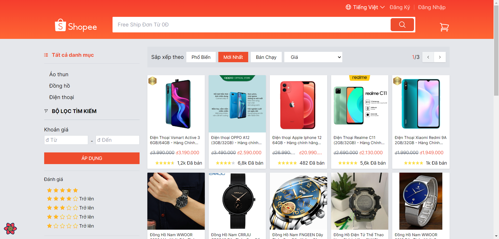

# [Shopee](https://github.com/Congglee/shopee-clone-reactjs-super)

An simple e-commerce shopee clone project from reactjs super course. It is bootstrapped with `vite`.

> **Warning**
> This project is still in development and is not ready for production use.

[]()

## Tech Stack

- **Library:** [ReactJS](https://react.dev/)
- **Styling:** [Tailwind CSS](https://tailwindcss.com), [HeadlessUI](https://headlessui.com/)
- **State Management:** [TanStack Query v4](https://tanstack.com/query/v4/docs/react/overview) for async state, [React Context](https://react.dev/reference/react/useContext) for regular state
- **Form Management:** [React Hook Form](https://react-hook-form.com/)
- **Router:** [React Router Dom v6](https://reactrouter.com/en/main)
- **Build Tool:** [Vite](https://vitejs.dev/)

## Features to be implemented

- [x] Clone Shopee user information page
- [x] Add 404 Pages
- [x] Add ErrorBoundary component
- [x] Lazyload components with react lazy and react router
- [x] Implement token refresh function
- [x] Multiple language in ReactJs with I18Next
- [x] Improve SEO with React Helmet
- [x] Unit Test & Integration Test for Clone Shopee project
- [ ] Storybook for React

## Running Locally

1. Clone the repository

   ```bash
   git clone https://github.com/Congglee/shopee-clone-reactjs-super.git
   ```

2. Install dependencies using yarn

   ```bash
   yarn install
   ```

3. Copy the `.env.example` to `.env` and update the variables.

   ```bash
   cp .env.example .env
   ```

4. Start the development server

   ```bash
   yarn dev
   ```
